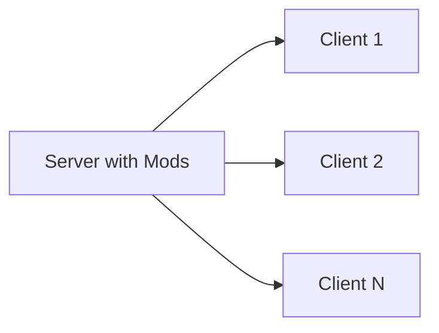

# Modding Architecture

Hytale uses a unique **server-first architecture** for all modifications.

## Server-Side Execution

All mods execute on the server:

### Benefits

- Players don't install mods
- Seamless server switching
- Enhanced security
- Instant mod updates

## How It Works

1. Player connects to server
2. Server streams required assets
3. Client renders content
4. All logic runs server-side

## Implications for Developers

- Design with server performance in mind
- Optimize asset sizes
- Implement validation server-side
- Test with multiple concurrent players

## Next Steps

- [Data Assets](/docs/modding/data-assets/overview)
- [Java Plugins](/docs/modding/plugins/overview)
