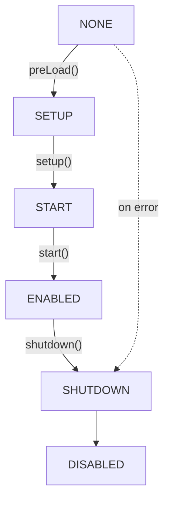

# Plugin Lifecycle

Understanding when and how your plugin code executes is essential for building reliable Hytale plugins. This guide covers the complete lifecycle from loading to shutdown.

## Lifecycle Overview



## Plugin States

Plugins transition through these states during their lifecycle:

| State | Description |
|-------|-------------|
| `NONE` | Initial state before any lifecycle method is called |
| `SETUP` | During `setup()` method execution |
| `START` | During `start()` method execution |
| `ENABLED` | Plugin is fully operational |
| `SHUTDOWN` | During `shutdown()` method execution |
| `DISABLED` | Plugin is disabled or failed to initialize |

```java
public enum PluginState {
   NONE,
   SETUP,
   START,
   ENABLED,
   SHUTDOWN,
   DISABLED;
}
```

## Lifecycle Methods

### preLoad()

The `preLoad()` method is called before `setup()` to asynchronously load configuration files. It returns a `CompletableFuture<Void>` that completes when all configs are loaded.

```java
@Nullable
public CompletableFuture<Void> preLoad() {
   if (this.configs.isEmpty()) {
      return null;
   } else {
      CompletableFuture<?>[] futures = new CompletableFuture[this.configs.size()];
      for (int i = 0; i < this.configs.size(); i++) {
         futures[i] = this.configs.get(i).load();
      }
      return CompletableFuture.allOf(futures);
   }
}
```

Configurations must be registered before `preLoad()` is called. Use `withConfig()` in your constructor:

```java
@Nonnull
protected final <T> Config<T> withConfig(@Nonnull BuilderCodec<T> configCodec) {
   return this.withConfig("config", configCodec);
}

@Nonnull
protected final <T> Config<T> withConfig(@Nonnull String name, @Nonnull BuilderCodec<T> configCodec) {
   if (this.state != PluginState.NONE) {
      throw new IllegalStateException("Must be called before setup");
   } else {
      Config<T> config = new Config<>(this.dataDirectory, name, configCodec);
      this.configs.add(config);
      return config;
   }
}
```

### setup()

The `setup()` method is where you register commands, events, assets, and components. This is called after all plugins have been loaded and configs have been preloaded.

```java
protected void setup() {
}
```

This is the primary initialization method. Override it to register your plugin's functionality.

### start()

The `start()` method is called after ALL plugins have completed their `setup()` phase. Use this for any logic that depends on other plugins being fully registered.

```java
protected void start() {
}
```

### shutdown()

The `shutdown()` method is called when the plugin is being disabled. Perform cleanup here before registries are cleaned up.

```java
protected void shutdown() {
}
```

## Loading Process

The plugin loading process follows these phases:

1. **Discovery** - Plugins are discovered from: core plugins, builtin directory, classpath (`manifest.json`/`manifests.json`), and the `mods` directory
2. **Dependency Validation** - Dependencies are validated against loaded plugins and server version requirements
3. **Load Order Calculation** - Plugins are sorted based on dependencies and `LoadBefore` declarations
4. **Instantiation** - Main class is loaded via reflection, constructor taking `JavaPluginInit` is invoked
5. **PreLoad** - `preLoad()` is called to load configs asynchronously
6. **Setup** - `setup()` is called to register commands, events, assets, etc.
7. **Start** - `start()` is called after all plugins are set up

## Constructor Requirement

All plugins must have a constructor that accepts a `JavaPluginInit` parameter:

```java
Constructor<?> constructor = mainClass.getConstructor(JavaPluginInit.class);
Path dataDirectory = PluginManager.MODS_PATH.resolve(manifest.getGroup() + "_" + manifest.getName());
JavaPluginInit init = new JavaPluginInit(manifest, dataDirectory, this.getPath(), this.urlClassLoader);
return (JavaPlugin)constructor.newInstance(init);
```

## Available Registries

During `setup()`, you have access to these registries for registering your plugin's functionality:

| Registry | Method | Description |
|----------|--------|-------------|
| `CommandRegistry` | `getCommandRegistry()` | Register console and in-game commands |
| `EventRegistry` | `getEventRegistry()` | Subscribe to game events |
| `AssetRegistry` | `getAssetRegistry()` | Register custom assets |
| `BlockStateRegistry` | `getBlockStateRegistry()` | Register block states |
| `EntityRegistry` | `getEntityRegistry()` | Register entity types |
| `TaskRegistry` | `getTaskRegistry()` | Schedule tasks |
| `ChunkStoreRegistry` | `getChunkStoreRegistry()` | Register chunk storage components |
| `EntityStoreRegistry` | `getEntityStoreRegistry()` | Register entity storage components |
| `ClientFeatureRegistry` | `getClientFeatureRegistry()` | Register client-side features |

### Command Registration

```java
@Nonnull
public CommandRegistry getCommandRegistry() {
   return this.commandRegistry;
}

// Usage:
getCommandRegistry().registerCommand(new MyCommand());
```

### Event Registration

```java
@Nonnull
public EventRegistry getEventRegistry() {
   return this.eventRegistry;
}

// Usage:
getEventRegistry().register(EventClass.class, this::handleEvent);
```

The `EventRegistry` supports multiple registration methods:

```java
// Default priority
register(Class<? super EventType> eventClass, Consumer<EventType> consumer)

// Specified priority
register(EventPriority priority, Class<? super EventType> eventClass, Consumer<EventType> consumer)

// Keyed listener
register(Class<? super EventType> eventClass, KeyType key, Consumer<EventType> consumer)

// Global listener (receives all events of the type)
registerGlobal(Class<? super EventType> eventClass, Consumer<EventType> consumer)

// Async listener
registerAsync(Class<? super EventType> eventClass, Function<CompletableFuture<EventType>, CompletableFuture<EventType>> function)
```

## Other Plugin APIs

### Logger Access

```java
@Nonnull
public HytaleLogger getLogger() {
   return this.logger;
}
```

### Data Directory

```java
@Nonnull
public Path getDataDirectory() {
   return this.dataDirectory;
}
```

### Manifest Access

```java
@Nonnull
public PluginManifest getManifest() {
   return this.manifest;
}
```

### Plugin Identifier

```java
@Nonnull
public PluginIdentifier getIdentifier() {
   return this.identifier;
}
```

## Real-World Examples

### BlockTickPlugin

This plugin demonstrates registering event listeners, systems, and codec types during `setup()`:

```java
public class BlockTickPlugin extends JavaPlugin implements IBlockTickProvider {
   private static BlockTickPlugin instance;

   public BlockTickPlugin(@Nonnull JavaPluginInit init) {
      super(init);
      instance = this;
   }

   @Override
   protected void setup() {
      TickProcedure.CODEC.register("BasicChance", BasicChanceBlockGrowthProcedure.class, BasicChanceBlockGrowthProcedure.CODEC);
      TickProcedure.CODEC.register("SplitChance", SplitChanceBlockGrowthProcedure.class, SplitChanceBlockGrowthProcedure.CODEC);
      this.getEventRegistry().registerGlobal(EventPriority.EARLY, ChunkPreLoadProcessEvent.class, this::discoverTickingBlocks);
      ChunkStore.REGISTRY.registerSystem(new ChunkBlockTickSystem.PreTick());
      ChunkStore.REGISTRY.registerSystem(new ChunkBlockTickSystem.Ticking());
      ChunkStore.REGISTRY.registerSystem(new MergeWaitingBlocksSystem());
      BlockTickManager.setBlockTickProvider(this);
   }
}
```

### BlockPhysicsPlugin

A simpler example showing event and system registration:

```java
public class BlockPhysicsPlugin extends JavaPlugin {
   public BlockPhysicsPlugin(@Nonnull JavaPluginInit init) {
      super(init);
   }

   @Override
   protected void setup() {
      this.getEventRegistry().register(LoadAssetEvent.class, BlockPhysicsPlugin::validatePrefabs);
      this.getChunkStoreRegistry().registerSystem(new BlockPhysicsSystems.Ticking());
   }
}
```

### BlockSpawnerPlugin

Example with a singleton pattern:

```java
public class BlockSpawnerPlugin extends JavaPlugin {
   private static final HytaleLogger LOGGER = HytaleLogger.forEnclosingClass();
   private ComponentType<ChunkStore, BlockSpawner> blockSpawnerComponentType;
   private static BlockSpawnerPlugin INSTANCE;

   public static BlockSpawnerPlugin get() {
      return INSTANCE;
   }

   public BlockSpawnerPlugin(@Nonnull JavaPluginInit init) {
      super(init);
      INSTANCE = this;
   }
}
```

## Complete Plugin Template

```java
package com.example.myplugin;

import com.hypixel.hytale.server.core.plugin.JavaPlugin;
import com.hypixel.hytale.server.core.plugin.JavaPluginInit;
import javax.annotation.Nonnull;

public class MyPlugin extends JavaPlugin {

   public MyPlugin(@Nonnull JavaPluginInit init) {
      super(init);
      // Register configs here with withConfig() if needed
   }

   @Override
   protected void setup() {
      // Register commands
      getCommandRegistry().registerCommand(new MyCommand());

      // Register event listeners
      getEventRegistry().register(MyEvent.class, this::handleMyEvent);

      getLogger().info("MyPlugin setup complete!");
   }

   @Override
   protected void start() {
      // Called after ALL plugins have completed setup()
      // Safe to interact with other plugins here
      getLogger().info("MyPlugin started!");
   }

   @Override
   protected void shutdown() {
      // Cleanup resources before registries are cleaned
      getLogger().info("MyPlugin shutting down...");
   }

   private void handleMyEvent(MyEvent event) {
      // Handle the event
   }
}
```

## Best Practices

1. **Register configs in the constructor** - Use `withConfig()` before `setup()` is called
2. **Use setup() for registration** - Register all commands, events, and assets during `setup()`
3. **Defer cross-plugin logic to start()** - If you need to interact with other plugins, do it in `start()` when all plugins are registered
4. **Clean up in shutdown()** - Release resources before the server shuts down
5. **Use the logger** - Access your plugin's logger via `getLogger()` for consistent logging
