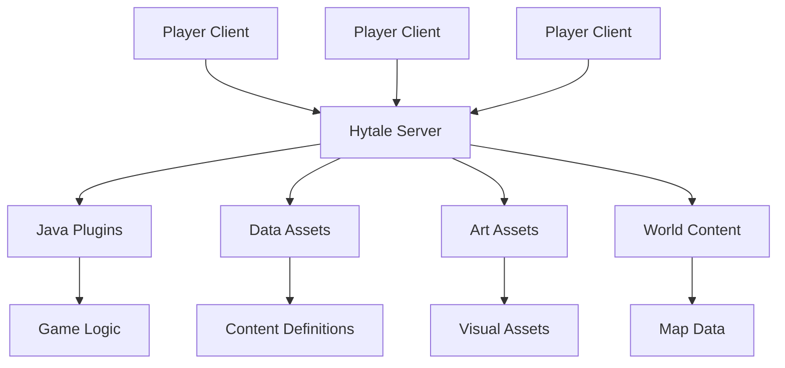

# Introduction au développement Hytale

Bienvenue dans le développement Hytale ! Ce guide vous aidera à comprendre les fondamentaux de la création de contenu pour Hytale.

## À propos de Hytale

Hytale a été lancé en Early Access le **13 janvier 2026**, développé par Hypixel Studios - une équipe de plus de 50 développeurs dirigée par les fondateurs originaux Simon Collins-Laflamme et Philippe Touchette, qui ont racheté le projet auprès de Riot Games en novembre 2025.

### Disponibilité

- **Plateformes :** Windows, macOS (M1+ avec macOS Tahoe) et Linux (Flatpak natif)
- **Distribution :** Disponible exclusivement via le launcher officiel sur [hytale.com](https://hytale.com) (pas sur Steam)
- **Tarifs :** Standard (19,99 $), Supporter (34,99 $), Cursebreaker Founders (69,99 $)
- **Joueurs :** Plus d'un million de joueurs attendus au lancement
- **Développement :** 2 ans de développement financés par les précommandes

## Pourquoi modder Hytale ?

Hytale a été conçu dès le départ avec le modding au coeur de son architecture. Contrairement à de nombreux jeux où le modding est une réflexion après coup, Hytale offre :

- **Support natif des mods** - Pas besoin de hacks ou de solutions de contournement
- **Execution cote serveur** - Tous les mods s'executent sur le serveur
- **Experience joueur fluide** - Les joueurs n'ont rien a telecharger
- **Outils professionnels** - Les memes outils utilises par Hypixel Studios

## Types de modifications

Hytale propose quatre categories principales de modifications :

### 1. Java Plugins

Des plugins complets ecrits en Java, similaires aux plugins Bukkit/Spigot :

```java
@PluginInfo(name = "MyPlugin", version = "1.0.0")
public class MyPlugin extends Plugin {
    @Override
    public void onEnable() {
        getLogger().info("Plugin enabled!");
    }
}
```

**Ideal pour :** Logique de jeu complexe, commandes personnalisees, systemes economiques

### 2. Data Assets (JSON)

Fichiers de configuration JSON qui definissent le contenu du jeu sans programmation :

```json
{
  "id": "my_custom_block",
  "displayName": "Ruby Block",
  "properties": {
    "hardness": 3.0,
    "resistance": 5.0
  }
}
```

**Ideal pour :** Nouveaux blocs, objets, PNJ, tables de butin

### 3. Art Assets

Modeles 3D personnalises, textures et animations :

- Modeles (`.blockymodel`)
- Animations (`.blockyanim`)
- Textures (PNG)
- Sons

**Ideal pour :** Creatures personnalisees, objets, decorations

### 4. World Content

Structures preconstruites et configurations de monde :

- Prefabs (structures reutilisables)
- Biomes personnalises
- Modifications de terrain

## Vue d'ensemble de l'architecture



### Philosophie Server-First

Toutes les modifications dans Hytale s'executent sur le serveur :

- Les joueurs se connectent avec un client non modifie
- Le serveur diffuse tout le contenu necessaire
- Aucune installation de mod requise pour les joueurs
- Changer de serveur est transparent

## Prochaines etapes

Pret a commencer ? Suivez ces guides dans l'ordre :

1. [**Prerequis**](/docs/getting-started/prerequisites) - Ce dont vous avez besoin d'installe
2. [**Configuration de l'environnement**](/docs/getting-started/environment-setup) - Configurez vos outils de developpement
3. [**Votre premier mod**](/docs/getting-started/first-mod) - Creez un mod simple

## Ressources utiles

- [Official Hytale Blog](https://hytale.com/news)
- [HytaleModding.dev](https://hytalemodding.dev)
- [Blockbench](https://www.blockbench.net/) - Outil de modelisation 3D
- [Hytale Discord](https://discord.gg/hytale)
