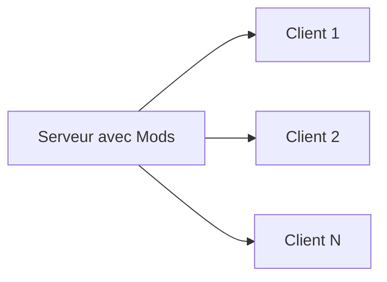

# Architecture du Modding

Hytale utilise une architecture unique **serveur-first** pour toutes les modifications.

## Exécution Côté Serveur

Tous les mods s'exécutent sur le serveur :

### Avantages

- Les joueurs n'installent pas de mods
- Changement de serveur transparent
- Sécurité renforcée
- Mises à jour instantanées des mods

## Comment ça Fonctionne

1. Le joueur se connecte au serveur
2. Le serveur transmet les assets requis
3. Le client affiche le contenu
4. Toute la logique s'exécute côté serveur

## Implications pour les Développeurs

- Concevez en pensant aux performances du serveur
- Optimisez la taille des assets
- Implémentez la validation côté serveur
- Testez avec plusieurs joueurs simultanés

## Prochaines Étapes

- [Data Assets](/docs/modding/data-assets/overview)
- [Plugins Java](/docs/modding/plugins/overview)
