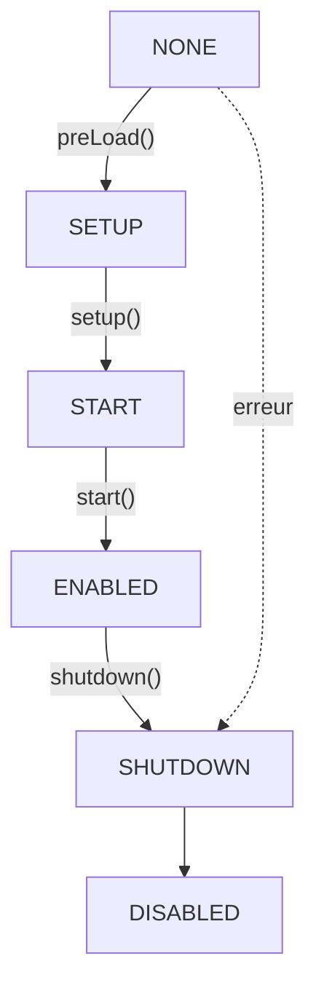

# Cycle de vie des plugins

Comprendre quand et comment le code de votre plugin s'exécute est essentiel pour créer des plugins Hytale fiables. Ce guide couvre le cycle de vie complet, du chargement à l'arrêt.

## Aperçu du cycle de vie



## États des plugins

Les plugins passent par ces états au cours de leur cycle de vie :

| État | Description |
|------|-------------|
| `NONE` | État initial avant l'appel de toute méthode du cycle de vie |
| `SETUP` | Pendant l'exécution de la méthode `setup()` |
| `START` | Pendant l'exécution de la méthode `start()` |
| `ENABLED` | Le plugin est entièrement opérationnel |
| `SHUTDOWN` | Pendant l'exécution de la méthode `shutdown()` |
| `DISABLED` | Le plugin est désactivé ou n'a pas réussi à s'initialiser |

```java
public enum PluginState {
   NONE,
   SETUP,
   START,
   ENABLED,
   SHUTDOWN,
   DISABLED;
}
```

## Méthodes du cycle de vie

### preLoad()

La méthode `preLoad()` est appelée avant `setup()` pour charger de manière asynchrone les fichiers de configuration. Elle retourne un `CompletableFuture<Void>` qui se termine lorsque toutes les configurations sont chargées.

```java
@Nullable
public CompletableFuture<Void> preLoad() {
   if (this.configs.isEmpty()) {
      return null;
   } else {
      CompletableFuture<?>[] futures = new CompletableFuture[this.configs.size()];
      for (int i = 0; i < this.configs.size(); i++) {
         futures[i] = this.configs.get(i).load();
      }
      return CompletableFuture.allOf(futures);
   }
}
```

Les configurations doivent être enregistrées avant l'appel de `preLoad()`. Utilisez `withConfig()` dans votre constructeur :

```java
@Nonnull
protected final <T> Config<T> withConfig(@Nonnull BuilderCodec<T> configCodec) {
   return this.withConfig("config", configCodec);
}

@Nonnull
protected final <T> Config<T> withConfig(@Nonnull String name, @Nonnull BuilderCodec<T> configCodec) {
   if (this.state != PluginState.NONE) {
      throw new IllegalStateException("Must be called before setup");
   } else {
      Config<T> config = new Config<>(this.dataDirectory, name, configCodec);
      this.configs.add(config);
      return config;
   }
}
```

### setup()

La méthode `setup()` est l'endroit où vous enregistrez les commandes, événements, assets et composants. Elle est appelée après le chargement de tous les plugins et le préchargement des configurations.

```java
protected void setup() {
}
```

C'est la méthode d'initialisation principale. Surchargez-la pour enregistrer les fonctionnalités de votre plugin.

### start()

La méthode `start()` est appelée après que TOUS les plugins ont terminé leur phase `setup()`. Utilisez-la pour toute logique qui dépend de l'enregistrement complet des autres plugins.

```java
protected void start() {
}
```

### shutdown()

La méthode `shutdown()` est appelée lorsque le plugin est en cours de désactivation. Effectuez le nettoyage ici avant que les registres ne soient nettoyés.

```java
protected void shutdown() {
}
```

## Processus de chargement

Le processus de chargement des plugins suit ces phases :

1. **Découverte** - Les plugins sont découverts depuis : les plugins de base, le répertoire intégré, le classpath (`manifest.json`/`manifests.json`), et le répertoire `mods`
2. **Validation des dépendances** - Les dépendances sont validées par rapport aux plugins chargés et aux exigences de version du serveur
3. **Calcul de l'ordre de chargement** - Les plugins sont triés en fonction des dépendances et des déclarations `LoadBefore`
4. **Instanciation** - La classe principale est chargée par réflexion, le constructeur prenant `JavaPluginInit` est invoqué
5. **PreLoad** - `preLoad()` est appelé pour charger les configurations de manière asynchrone
6. **Setup** - `setup()` est appelé pour enregistrer les commandes, événements, assets, etc.
7. **Start** - `start()` est appelé après que tous les plugins sont configurés

## Exigence du constructeur

Tous les plugins doivent avoir un constructeur qui accepte un paramètre `JavaPluginInit` :

```java
Constructor<?> constructor = mainClass.getConstructor(JavaPluginInit.class);
Path dataDirectory = PluginManager.MODS_PATH.resolve(manifest.getGroup() + "_" + manifest.getName());
JavaPluginInit init = new JavaPluginInit(manifest, dataDirectory, this.getPath(), this.urlClassLoader);
return (JavaPlugin)constructor.newInstance(init);
```

## Registres disponibles

Pendant `setup()`, vous avez accès à ces registres pour enregistrer les fonctionnalités de votre plugin :

| Registre | Méthode | Description |
|----------|---------|-------------|
| `CommandRegistry` | `getCommandRegistry()` | Enregistrer les commandes de console et en jeu |
| `EventRegistry` | `getEventRegistry()` | S'abonner aux événements du jeu |
| `AssetRegistry` | `getAssetRegistry()` | Enregistrer des assets personnalisés |
| `BlockStateRegistry` | `getBlockStateRegistry()` | Enregistrer les états de blocs |
| `EntityRegistry` | `getEntityRegistry()` | Enregistrer les types d'entités |
| `TaskRegistry` | `getTaskRegistry()` | Planifier des tâches |
| `ChunkStoreRegistry` | `getChunkStoreRegistry()` | Enregistrer les composants de stockage de chunks |
| `EntityStoreRegistry` | `getEntityStoreRegistry()` | Enregistrer les composants de stockage d'entités |
| `ClientFeatureRegistry` | `getClientFeatureRegistry()` | Enregistrer les fonctionnalités côté client |

### Enregistrement des commandes

```java
@Nonnull
public CommandRegistry getCommandRegistry() {
   return this.commandRegistry;
}

// Utilisation :
getCommandRegistry().registerCommand(new MyCommand());
```

### Enregistrement des événements

```java
@Nonnull
public EventRegistry getEventRegistry() {
   return this.eventRegistry;
}

// Utilisation :
getEventRegistry().register(EventClass.class, this::handleEvent);
```

Le `EventRegistry` prend en charge plusieurs méthodes d'enregistrement :

```java
// Priorité par défaut
register(Class<? super EventType> eventClass, Consumer<EventType> consumer)

// Priorité spécifiée
register(EventPriority priority, Class<? super EventType> eventClass, Consumer<EventType> consumer)

// Écouteur avec clé
register(Class<? super EventType> eventClass, KeyType key, Consumer<EventType> consumer)

// Écouteur global (reçoit tous les événements du type)
registerGlobal(Class<? super EventType> eventClass, Consumer<EventType> consumer)

// Écouteur asynchrone
registerAsync(Class<? super EventType> eventClass, Function<CompletableFuture<EventType>, CompletableFuture<EventType>> function)
```

## Autres API des plugins

### Accès au logger

```java
@Nonnull
public HytaleLogger getLogger() {
   return this.logger;
}
```

### Répertoire de données

```java
@Nonnull
public Path getDataDirectory() {
   return this.dataDirectory;
}
```

### Accès au manifeste

```java
@Nonnull
public PluginManifest getManifest() {
   return this.manifest;
}
```

### Identifiant du plugin

```java
@Nonnull
public PluginIdentifier getIdentifier() {
   return this.identifier;
}
```

## Exemples concrets

### BlockTickPlugin

Ce plugin démontre l'enregistrement d'écouteurs d'événements, de systèmes et de types de codec pendant `setup()` :

```java
public class BlockTickPlugin extends JavaPlugin implements IBlockTickProvider {
   private static BlockTickPlugin instance;

   public BlockTickPlugin(@Nonnull JavaPluginInit init) {
      super(init);
      instance = this;
   }

   @Override
   protected void setup() {
      TickProcedure.CODEC.register("BasicChance", BasicChanceBlockGrowthProcedure.class, BasicChanceBlockGrowthProcedure.CODEC);
      TickProcedure.CODEC.register("SplitChance", SplitChanceBlockGrowthProcedure.class, SplitChanceBlockGrowthProcedure.CODEC);
      this.getEventRegistry().registerGlobal(EventPriority.EARLY, ChunkPreLoadProcessEvent.class, this::discoverTickingBlocks);
      ChunkStore.REGISTRY.registerSystem(new ChunkBlockTickSystem.PreTick());
      ChunkStore.REGISTRY.registerSystem(new ChunkBlockTickSystem.Ticking());
      ChunkStore.REGISTRY.registerSystem(new MergeWaitingBlocksSystem());
      BlockTickManager.setBlockTickProvider(this);
   }
}
```

### BlockPhysicsPlugin

Un exemple plus simple montrant l'enregistrement d'événements et de systèmes :

```java
public class BlockPhysicsPlugin extends JavaPlugin {
   public BlockPhysicsPlugin(@Nonnull JavaPluginInit init) {
      super(init);
   }

   @Override
   protected void setup() {
      this.getEventRegistry().register(LoadAssetEvent.class, BlockPhysicsPlugin::validatePrefabs);
      this.getChunkStoreRegistry().registerSystem(new BlockPhysicsSystems.Ticking());
   }
}
```

### BlockSpawnerPlugin

Exemple avec un pattern singleton :

```java
public class BlockSpawnerPlugin extends JavaPlugin {
   private static final HytaleLogger LOGGER = HytaleLogger.forEnclosingClass();
   private ComponentType<ChunkStore, BlockSpawner> blockSpawnerComponentType;
   private static BlockSpawnerPlugin INSTANCE;

   public static BlockSpawnerPlugin get() {
      return INSTANCE;
   }

   public BlockSpawnerPlugin(@Nonnull JavaPluginInit init) {
      super(init);
      INSTANCE = this;
   }
}
```

## Modèle complet de plugin

```java
package com.example.myplugin;

import com.hypixel.hytale.server.core.plugin.JavaPlugin;
import com.hypixel.hytale.server.core.plugin.JavaPluginInit;
import javax.annotation.Nonnull;

public class MyPlugin extends JavaPlugin {

   public MyPlugin(@Nonnull JavaPluginInit init) {
      super(init);
      // Enregistrez les configurations ici avec withConfig() si nécessaire
   }

   @Override
   protected void setup() {
      // Enregistrer les commandes
      getCommandRegistry().registerCommand(new MyCommand());

      // Enregistrer les écouteurs d'événements
      getEventRegistry().register(MyEvent.class, this::handleMyEvent);

      getLogger().info("Configuration de MyPlugin terminée !");
   }

   @Override
   protected void start() {
      // Appelé après que TOUS les plugins ont terminé setup()
      // Il est sûr d'interagir avec d'autres plugins ici
      getLogger().info("MyPlugin démarré !");
   }

   @Override
   protected void shutdown() {
      // Nettoyer les ressources avant que les registres ne soient nettoyés
      getLogger().info("Arrêt de MyPlugin en cours...");
   }

   private void handleMyEvent(MyEvent event) {
      // Gérer l'événement
   }
}
```

## Bonnes pratiques

1. **Enregistrez les configurations dans le constructeur** - Utilisez `withConfig()` avant l'appel de `setup()`
2. **Utilisez setup() pour l'enregistrement** - Enregistrez toutes les commandes, événements et assets pendant `setup()`
3. **Différez la logique inter-plugins à start()** - Si vous devez interagir avec d'autres plugins, faites-le dans `start()` quand tous les plugins sont enregistrés
4. **Nettoyez dans shutdown()** - Libérez les ressources avant l'arrêt du serveur
5. **Utilisez le logger** - Accédez au logger de votre plugin via `getLogger()` pour une journalisation cohérente
