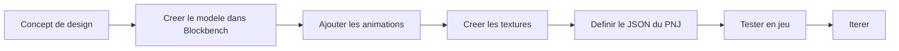

# Apercu des outils de developpement

Hytale fournit une suite d'outils pour la creation de contenu, de la modelisation 3D a l'edition en jeu. Selon la [Strategie de modding](https://hytale.com/news/2025/11/hytale-modding-strategy-and-status) officielle, Hypixel Studios vise a fournir les memes outils utilises en interne par l'equipe de developpement.

## Outils officiels

### Blockbench + Plugin Hytale

L'outil officiel pour creer des modeles 3D et des animations. Blockbench remplace l'outil interne "Hytale Model Maker" pour mieux supporter les workflows creatifs etablis dans la communaute.

> "Nous supportons officiellement Blockbench pour creer des modeles, textures et animations Hytale."
> — [Strategie de modding Hytale](https://hytale.com/news/2025/11/hytale-modding-strategy-and-status)

**Fonctionnalites :**
- Creer des fichiers `.blockymodel` avec des ratios de pixels coherents
- Animer avec le format `.blockyanim`
- Support de la hierarchie des os
- Export en direct vers des formats compatibles Hytale
- Ameliorations de qualite de vie pour le workflow Hytale

**Installation :**
1. Telecharger [Blockbench](https://www.blockbench.net/)
2. Installer le [plugin Hytale](https://github.com/JannisX11/hytale-blockbench-plugin) depuis le gestionnaire de plugins

**Ressources officielles :**
- [Une introduction a la creation de modeles pour Hytale](https://hytale.com/news/2025/12/an-introduction-to-making-models-for-hytale)
- [Depot GitHub](https://github.com/JannisX11/hytale-blockbench-plugin)

[Guide Blockbench →](/docs/tools/blockbench/installation)

### Editeur d'assets Hytale

Editeur integre pour les assets de donnees JSON.

**Fonctionnalites :**
- Editer des blocs, objets, PNJ
- Rechargement en direct - voir les changements instantanement
- Aucune programmation requise

**Limitations :**
- Certains types d'assets ne sont pas encore supportes
- Editeurs de PNJ et de generation de monde incomplets

[Guide de l'editeur d'assets →](/docs/tools/asset-editor/overview)

### Editeur de graphe d'assets

Editeur base sur des noeuds pour les systemes complexes.

**Cas d'utilisation :**
- Generation de monde
- Comportements des PNJ
- Pinceaux scriptes

:::note En developpement
L'editeur de graphe d'assets n'est pas completement abouti au lancement mais sera ameliore.
:::

### Outils du mode creatif

Outils en jeu pour la construction de mondes. Selon l'article officiel sur le [Mode creatif](https://hytale.com/news/2025/11/hytale-creative-mode) :

> "En passant en mode creatif dans votre monde, vous pouvez voler et explorer, creer, editer, faire exploser des choses, et plus encore."
> — Ktar, Ingenieur Mode Creatif

**Fonctionnalites :**
- **Pinceau** : Peindre des formes (pyramides, cones, carres) avec des materiaux, densite et masques personnalisables
- **Systeme de prefabs** : Charger et editer des prefabs dans un environnement d'edition separe
- **Changeur de modele** : Acces a plus de 100 modeles de PNJ differents pour la creation de contenu
- **Vol personnalisable** : Ajuster la vitesse, les controles, le mode de vol (stationnaire/directionnel) et l'inertie
- Selection et copier/coller

[Guide du mode creatif →](/docs/tools/creative-mode)

### Outils Machinima

Creer des cinematiques et des videos avec une animation de camera basee sur des images cles.

**Fonctionnalites :**
- **Acteur camera** : Creer des entites camera avec animation par images cles
- Definir des trajectoires, vitesses et comportements personnalises
- Creer des sequences cinematiques pour les bandes-annonces et le contenu

> "Les outils Machinima ont beaucoup plus de fonctionnalites que celles presentees dans les demos rapides, et ils sont prevus pour une mise a niveau massive en termes de fonctionnalites et d'experience utilisateur dans les mois suivant le lancement."
> — [Mode creatif Hytale](https://hytale.com/news/2025/11/hytale-creative-mode)

[Guide Machinima →](/docs/tools/machinima)

## Outils externes

### Recommandations d'IDE

| IDE | Ideal pour | Cout |
|-----|----------|------|
| IntelliJ IDEA | Plugins Java | Gratuit (Community) |
| VS Code | Edition JSON, general | Gratuit |
| Eclipse | Plugins Java | Gratuit |

### Controle de version

Utilisez Git pour gerer vos projets :

```bash
git init
git add .
git commit -m "Initial commit"
```

### Editeurs d'images

Pour la creation de textures :

- [GIMP](https://www.gimp.org/) - Gratuit, complet
- [Aseprite](https://www.aseprite.org/) - Specialise pixel art
- Photoshop - Standard de l'industrie

## Comparaison des outils

| Tache | Outil recommande |
|------|-----------------|
| Modeles 3D | Blockbench |
| Animations | Blockbench |
| Textures | GIMP / Photoshop |
| Donnees JSON | Asset Editor / VS Code |
| Plugins Java | IntelliJ IDEA |
| Construction de monde | Mode creatif |

## Exemple de workflow

Creation d'une creature personnalisee :



## Formats de fichiers

| Format | Utilisation | Outil |
|--------|---------|------|
| `.blockymodel` | Modeles 3D | Blockbench |
| `.blockyanim` | Animations | Blockbench |
| `.json` | Assets de donnees | Asset Editor |
| `.png` | Textures | Editeur d'image |
| `.jar` | Plugins Java | IDE |

## Pour commencer

<div className="doc-card-grid">
  <DocCard item={{
    type: 'link',
    label: 'Configuration de Blockbench',
    href: '/docs/tools/blockbench/installation',
    description: 'Installer et configurer Blockbench'
  }} />
  <DocCard item={{
    type: 'link',
    label: 'Editeur d\'assets',
    href: '/docs/tools/asset-editor/overview',
    description: 'Apprendre l\'editeur integre'
  }} />
</div>
